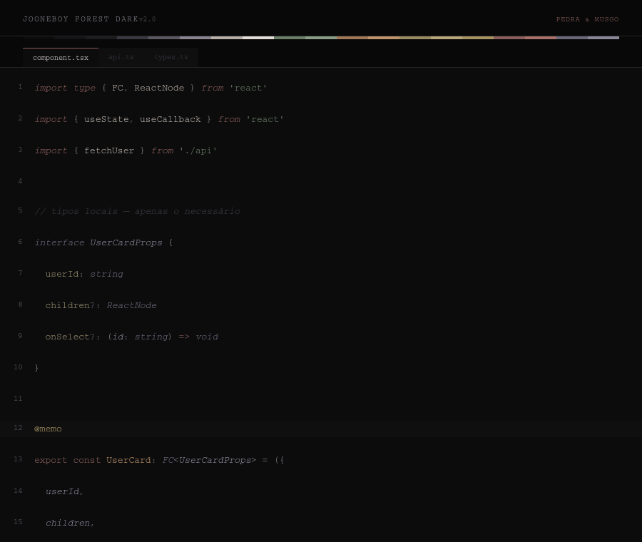
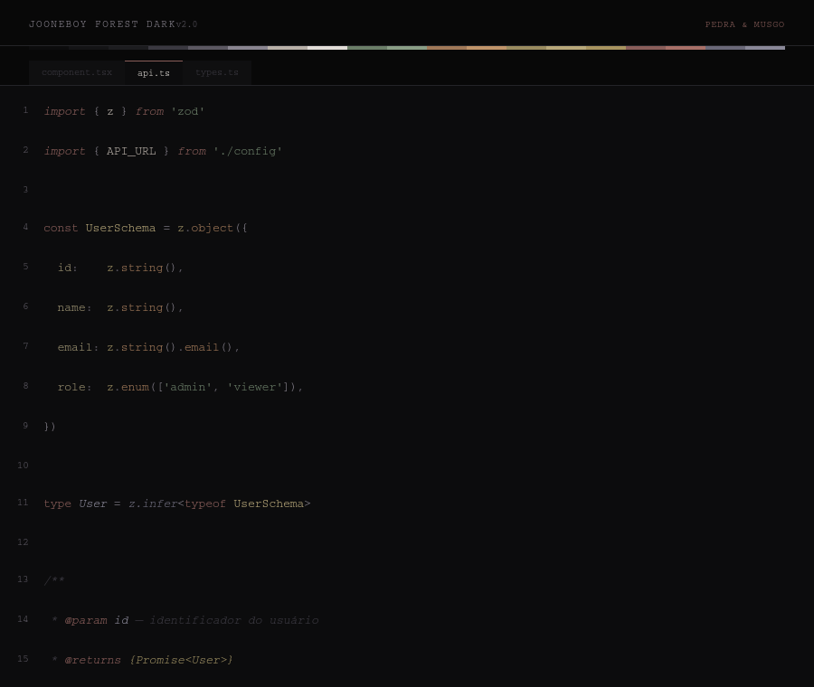
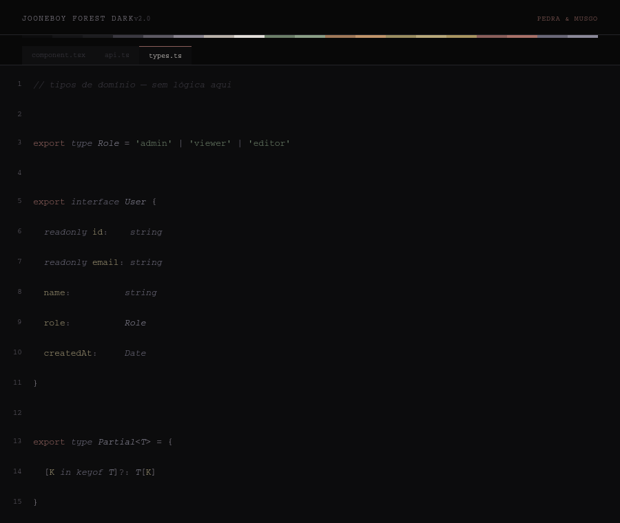

# Jooneboy Forest Dark


Tema dark para VS Code com fundo preto frio e paleta terrosa dessaturada. Desenvolvido especificamente para o ecossistema JavaScript e TypeScript — com atenção à distinção semântica entre tipos, funções, variáveis e keywords.

## Preview







## Paleta

| Papel                 | Cor       | Token          |
| --------------------- | --------- | -------------- |
| Background editor     | `#0C0C0D` | `stone_void`   |
| Foreground principal  | `#B8B0A8` | `clay`         |
| Foreground máximo     | `#E2DDD8` | `chalk`        |
| Comentários           | `#3A3840` | `ash_dim`      |
| Strings               | `#6B7E68` | `moss`         |
| Template literals     | `#8A9E86` | `moss_light`   |
| Funções (call)        | `#A07858` | `siena`        |
| Funções (decl)        | `#C0946A` | `siena_light`  |
| Variáveis             | `#9A8C60` | `ochre`        |
| Constantes            | `#B8A87A` | `ochre_light`  |
| Keywords              | `#8A5E5A` | `terra`        |
| Control flow          | `#A87068` | `terra_bright` |
| Types TS              | `#6A6878` | `slate`        |
| Interfaces / generics | `#8A8898` | `slate_light`  |
| Números / enums       | `#A89460` | `amber`        |

## Destaques do tema

**Sistema de tipos TypeScript isolado** — types, interfaces, generics e type operators usam a família `slate` (violáceo frio), completamente separada das outras categorias. `<Button>` em JSX e `type Foo = ...` são visualmente distintos sem ambiguidade.

**Distinção decl vs call** — funções declaradas (`#C0946A`) são mais claras que chamadas (`#A07858`). O olho identifica pontos de definição sem esforço.

**Itálico contido** — aplicado apenas onde tem significado semântico: comentários, parâmetros, `async/await`, tipos e modificadores. Nenhum itálico decorativo.

**Line numbers legíveis** — `#5C5862` nos inativos, `#8A8590` no ativo. Contraste real em qualquer monitor.

**Imports sem destaque** — bindings de import ficam em `clay` neutro. A atenção visual fica no código, não nos cabeçalhos de arquivo.

## Instalação

1. Abra o VS Code
2. Vá em Extensions (`Ctrl+Shift+X`)
3. Pesquise por **Jooneboy**
4. Clique em Install
5. `File > Preferences > Color Theme > Jooneboy Forest Dark`

## Configuração recomendada

Para melhor experiência com o tema, adicione ao seu `settings.json`:

```json
{
  "workbench.colorTheme": "Jooneboy Dark",
  "workbench.iconTheme": "symbols",
  "workbench.productIconTheme": "fluent-icons",

  "editor.fontFamily": "JetBrains Mono",
  "editor.fontLigatures": true,
  "editor.fontSize": 13,
  "editor.fontWeight": "300",
  "editor.lineHeight": 1.8,
  "editor.letterSpacing": 0.3,
  "editor.cursorStyle": "line",
  "editor.cursorWidth": 1,
  "editor.cursorBlinking": "phase",
  "editor.renderLineHighlight": "gutter",
  "editor.guides.indentation": true,
  "editor.guides.bracketPairs": false,
  "editor.minimap.enabled": false,
  "editor.renderWhitespace": "none",
  "editor.smoothScrolling": true,

  "breadcrumbs.enabled": false,
  "window.titleBarStyle": "custom",

  "terminal.integrated.fontFamily": "JetBrainsMono Nerd Font",
  "terminal.integrated.fontSize": 13,
  "terminal.integrated.lineHeight": 1.6
}
```

## Fonte

O tema foi desenvolvido com **JetBrains Mono** weight 300. O traço fino valoriza a paleta dessaturada sem competir com as cores. Alternativas compatíveis: Geist Mono, Commit Mono, Input Mono.

Para o terminal, qualquer variante **Nerd Font** da fonte escolhida.

## Contribuições

Issues e pull requests são bem-vindos.

1. Fork o projeto
2. Crie sua branch (`git checkout -b fix/minha-correcao`)
3. Commit (`git commit -m 'Descrição da mudança'`)
4. Push (`git push origin fix/minha-correcao`)
5. Abra um Pull Request

Reporte problemas em [github.com/joaomjbraga/jooneboy-theme/issues](https://github.com/joaomjbraga/jooneboy-theme/issues)

---

Criado por [João Marcos de Jesus Braga](https://github.com/joaomjbraga) — MIT License
