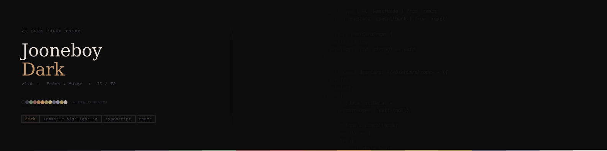
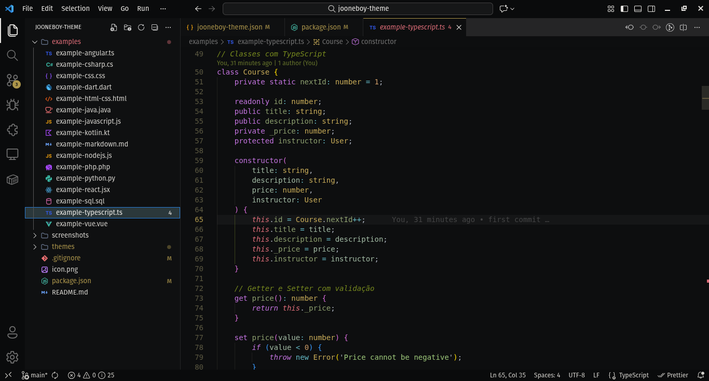

# Jooneboy Dark





Tema dark para VS Code com paleta orgânica mineral. Desenvolvido para o ecossistema JavaScript e TypeScript — com cobertura completa para SQL, Docker, Shell, CSS e Markdown.

## Paleta

| Papel                 | Cor       | Nome          |
| --------------------- | --------- | ------------- |
| Background editor     | `#201F27` | `bg_mid`      |
| Foreground principal  | `#C9C3BC` | `fg_base`     |
| Foreground máximo     | `#EDE7E0` | `fg_bright`   |
| Comentários           | `#4A4658` | `fg_ghost`    |
| Strings               | `#72A188` | `moss`        |
| Template literals     | `#93BDA6` | `moss_light`  |
| Funções (call)        | `#BC836B` | `siena`       |
| Funções (decl)        | `#D09B80` | `siena_light` |
| Variáveis             | `#B4A568` | `ochre`       |
| Constantes            | `#CCBB83` | `ochre_light` |
| Keywords              | `#AE7C80` | `terra`       |
| Control flow          | `#C5726C` | `terra_ctrl`  |
| Types TS              | `#8389B4` | `slate`       |
| Interfaces / generics | `#969CC4` | `slate_light` |
| Números / enums       | `#BCA16B` | `amber`       |

### Filosofia de cor

Backgrounds em **H:248°** (azul-violeta basáltico sutil) criam profundidade fria. Foregrounds em tom areia quente (**H:35°**) produzem contraste térmico que reduz fadiga em sessões longas. Accents com hues orgânicos — musgo frio (H:148°), terracota (H:18°), ardósia azul (H:232°) — dão ao tema identidade visual própria.

Todos os tokens de texto passam **WCAG AA** (≥4.5:1). O texto principal atinge **9.3:1 AAA**.

## Destaques

**Sistema de tipos TypeScript isolado** — types, interfaces, generics e type operators usam a família `slate` (azul-ardósia), completamente separada das outras categorias.

**Distinção decl vs call** — funções declaradas são mais claras que chamadas. O olho localiza pontos de definição sem esforço.

**Itálico com significado** — aplicado apenas onde tem semântica: comentários, parâmetros, `async/await`, tipos e modificadores.

**Imports sem destaque** — bindings de import ficam em `fg_base` neutro. A atenção visual fica no código, não nos cabeçalhos de arquivo.

**Cobertura profissional completa** — SQL, Dockerfile, Shell/Bash, Markdown, CSS/SCSS, YAML/TOML, JSON e RegExp com regras granulares.

## Instalação

1. Abra o VS Code
2. Vá em Extensions (`Ctrl+Shift+X`)
3. Pesquise por **Jooneboy**
4. Clique em Install
5. `File > Preferences > Color Theme > Jooneboy Dark`

## Configuração recomendada

```json
{
  "workbench.colorTheme": "Jooneboy Dark",
  "workbench.iconTheme": "symbols",
  "workbench.productIconTheme": "fluent-icons",

  "editor.fontFamily": "JetBrains Mono",
  "editor.fontLigatures": true,
  "editor.fontSize": 13,
  "editor.fontWeight": "300",
  "editor.lineHeight": 1.8,
  "editor.letterSpacing": 0.3,
  "editor.cursorStyle": "line",
  "editor.cursorWidth": 1,
  "editor.cursorBlinking": "phase",
  "editor.renderLineHighlight": "gutter",
  "editor.guides.indentation": true,
  "editor.guides.bracketPairs": false,
  "editor.minimap.enabled": false,
  "editor.renderWhitespace": "none",
  "editor.smoothScrolling": true,

  "breadcrumbs.enabled": false,
  "window.titleBarStyle": "custom",

  "terminal.integrated.fontFamily": "JetBrainsMono Nerd Font",
  "terminal.integrated.fontSize": 13,
  "terminal.integrated.lineHeight": 1.6
}
```

## Fonte

Desenvolvido com **JetBrains Mono** weight 300. O traço fino complementa a paleta dessaturada. Alternativas compatíveis: Geist Mono, Commit Mono, Input Mono.

## Contribuições

Issues e pull requests são bem-vindos.

1. Fork o projeto
2. Crie sua branch (`git checkout -b fix/minha-correcao`)
3. Commit (`git commit -m 'Descrição da mudança'`)
4. Push (`git push origin fix/minha-correcao`)
5. Abra um Pull Request

Reporte problemas em [github.com/joaomjbraga/jooneboy-theme/issues](https://github.com/joaomjbraga/jooneboy-theme/issues)

---

Criado por [João Marcos de Jesus Braga](https://github.com/joaomjbraga) — MIT License
